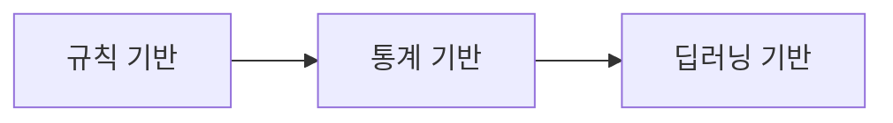

언어학 - 전산 언어학
---

# 🧠 언어학 vs 전산 언어학

## 📌 언어학 (Linguistics)

* 인간의 언어를 **구조적·기능적·의미적 측면에서 연구**하는 학문
* 다루는 분야:

  * 음운론(소리), 형태론(단어 구조), 통사론(문장 구조), 의미론(의미), 화용론(상황 속 의미)

## 💻 전산 언어학 (Computational Linguistics)

* **언어학 + 컴퓨터 과학**의 융합
* 언어 데이터를 컴퓨터가 **처리·분석·이해**할 수 있도록 하는 기술
* 자연어처리(NLP)의 핵심 기반

  * 형태소 분석기, 품사 태깅, 기계 번역, 음성 인식 등에 사용

---

# 🔍 NLP의 3가지 접근 방식

| 접근 방식     | 설명                                   | 장점              | 단점                 |
| --------- | ------------------------------------ | --------------- | ------------------ |
| 🧠 규칙 기반  | 사람이 언어 규칙을 직접 정의 (ex. if-else)       | 명확한 구조, 설명 가능   | 확장성 부족, 예외 처리 어려움  |
| 📊 통계 기반  | 코퍼스를 기반으로 확률/빈도 계산 (ex. n-gram, HMM) | 불확실성 처리 가능, 자동화 | 문맥 표현 한계, 데이터 필요   |
| 🤖 딥러닝 기반 | 신경망으로 의미/문맥 학습 (ex. BERT, GPT)       | 문맥·추론·생성 등 강력   | 많은 연산/데이터, 블랙박스 문제 |

### 📌 시대 흐름

---

# 🧱 음절, 형태소, 어절, 품사 개념 정리

| 항목      | 정의           | 예시                | NLP에서의 활용     |
| ------- | ------------ | ----------------- | ------------- |
| **음절**  | 발음상 가장 작은 단위 | "학교" → 학/교        | 주로 음성 처리에서 사용 |
| **형태소** | 의미를 가진 최소 단위 | "먹었다" → 먹/었/다     | 형태소 분석, 품사 태깅 |
| **어절**  | 띄어쓰기 기준 단위   | "나는 밥을 먹었다" → 4어절 | 문장 분할, 구문 분석  |
| **품사**  | 단어의 문법적 역할   | 명사, 동사, 조사 등      | 품사 태깅, 불용어 제거 |

---

# 🧬 형태소의 분류

## 🔹 의존성에 따른 분류

| 분류         | 정의                  | 예시         |
| ---------- | ------------------- | ---------- |
| **자립 형태소** | 혼자서도 의미를 가지는 형태소    | 나, 집, 가다   |
| **의존 형태소** | 다른 말에 붙어서만 사용되는 형태소 | -은, -을, -다 |

## 🔹 의미 여부에 따른 분류

| 분류         | 정의              | 예시         |
| ---------- | --------------- | ---------- |
| **실질 형태소** | 실제 사물·행동·성질을 표현 | 책, 먹, 예쁘   |
| **형식 형태소** | 문법적 기능만 수행      | -는, -을, -았 |

---

# 📚 정리 요약

* **언어학**: 사람의 언어 자체를 연구
* **전산 언어학**: 언어를 컴퓨터로 분석·처리하는 기술 (NLP 포함)
* **NLP 접근법**: 규칙 → 통계 → 딥러닝 순으로 진화
* **음절~품사**: 텍스트 분석의 기본 단위
* **형태소 분류**: 의미/문법, 독립성에 따라 2x2 분류 가능

---

